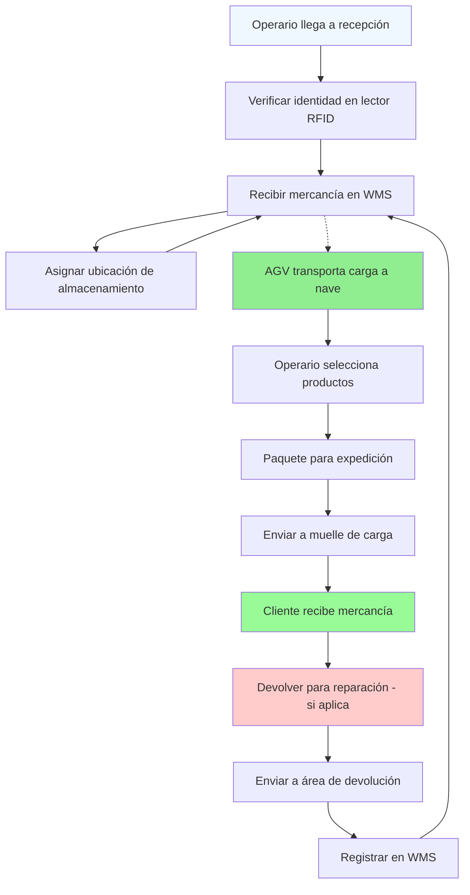

# Fase 0 — Preparación y encuadre

## Objetivo de la fase

Definir el alcance completo del proyecto, identificar todos los grupos de interés, establecer tres variantes de oferta para el cliente, y detallar la experiencia de usuario que el ED Park proporcionará. Esta fase asegura que el proyecto sea realista, vendible y completo.

## 0.4 Alcance del proyecto

### 4.1 Definición del alcance

**Proyecto**: Implementación del sistema completo de ED Park (parque logístico de productos electrónicos) en Matanzas, Cuba.

**Incluye**:
- Construcción de infraestructura física (2 naves principales + recepción + expedición + oficinas + patio + aparcamiento + zona AGV + área verde)
- Diseño e implementación de infraestructura completa de telecomunicaciones según Tema Nº 12
- Diseño virtual de software de gestión (WMS, control de AGV, integración V2X/V2I, SCADA)
- Adquisición e instalación de equipos (AGV/AMR, equipos de red, sensores IoT, servers, gateways)
- Montaje, prueba e integración de sistemas completos
- Puesta en marcha y validación técnica
- Implementación del software (sin código fuente, solo diseño y gestión)

**Excluye**:
- Desarrollos de software adicionales no especificados en el alcance
- Modificaciones estructurales más allá de las especificadas
- Capacitación del personal más allá de las especificaciones del proveedor
- Mantenimiento y servicios post-venta más allá de la garantía del proyecto

### 4.2 Limitaciones

- **Superficie física**: 0.5 hectáreas (5,000 m²) exactas
- **Nivel de automatización**: Medio (5-8 unidades AGV/AMR)
- **Personal**: ~38 personas máximo
- **Normativa**: Aplicación estricta de GOST 7.32-2017 para documentación y GOST 7.1-2003 para bibliografía
- **Plazo**: Inicio de semester (fecha exacta por confirmar)

## 0.5 Identificación de stakeholders

### 5.1 Lista principal de stakeholders

| Stakeholder                | Rol                                        | Interés                                          | Impacto | Requisitos Clave                                                        |
| -------------------------- | ------------------------------------------ | ------------------------------------------------ | ------- | ----------------------------------------------------------------------- |
| **Propietario/Cliente**    | Operador del parque logístico              | ROI, eficiencia operativa                        | Alto    | Sistema confiable, coste total de propiedad bajo, escalabilidad         |
| **Operarios**              | Personal de recepción, picking, expedición | Facilidad de uso, seguridad                      | Alto    | Interface intuitiva, capacitación mínima, soporte técnico               |
| **Técnicos**               | Ingenieros, técnicos de mantenimiento      | Control, monitorización, resolución de problemas | Medio   | Acceso de administrador, alertas automáticas, datos históricos          |
| **Desarrolladores**        | Equipo de TI proveedor                     | Arquitectura flexible, documentación             | Medio   | API estandarizadas, código modular, compatibilidad con sistemas futuros |
| **Instaladores**           | Equipo de montaje físico                   | Acceso a equipo, cronograma de trabajo           | Medio   | Información de equipos clara, planos precisos, coordinación logística   |
| **Supervisor de proyecto** | Gestión del proyecto                       | Costo, plazo, calidad                            | Alto    | Reportes detallados, gestión de riesgos, control de cambios             |
| **Aprobador académico**    | Profesor                                   | Calidad académica, cumplimiento GOST             | Alto    | Documentación completa, formato académico, calidad técnica              |

### 5.2 Matriz de intereses de stakeholders

**Alto interés-alto impacto (prioridad 1)**:
- Propietario/Cliente
- Supervisor de proyecto
- Aprobador académico

**Medio interés-alto impacto (prioridad 2)**:
- Operarios
- Técnicos
- Instaladores

**Medio interés-medio impacto (prioridad 3)**:
- Desarrolladores

### 5.3 Estrategia de comunicación

- **Propietario/Cliente**: Reportes semanales, revisiones de progreso mensuales, presentaciones de hitos
- **Operarios/Técnicos**: Capacitación inicial, manuales de usuario, soporte técnico dedicado
- **Desarrolladores/Instaladores**: Documentación técnica detallada, reuniones de coordinación diarias
- **Aprobador académico**: Documentos de progreso formales, actualizaciones de cumplimiento GOST, defensa técnica

## 0.11 Análisis de variantes para el cliente

### 11.1 Tres niveles de oferta

#### Variante Básica (Standard)
- **Costo**: ~75% del nivel completo
- **Características**:
  - Naves principales (2) + recepción + oficinas
  - Wi-Fi 6 industrial (basic coverage)
  - 3 unidades AGV (mínimo requerido)
  - Switches Ethernet industriales (basic)
  - WMS básico con funcionalidad limitada
  - Sistemas V2X/V2I mínimos
  - sincronización de tiempo PTP básica

#### Variante Intermedia (Recomendada)
- **Costo**: ~100% (nivel base)
- **Características** (Todo lo básico +):
  - Patio de maniobras completo + aparcamiento + zona AGV
  - Wi-Fi 6/6E completo + LTE privado adicional
  - 5-8 unidades AGV/AMR (nivel medio)
  - Switches industriales redundantes + mesh wireless
  - WMS completo + control de AGV + integración V2X/V2I
  - Servidores de comunicación + gateways + edge-gateways
  - Redundancia completa de canales + ciberseguridad industrial
  - sincronización de tiempo PTP con alta precisión
  - Montaje e instalación completos
  - Puesta en marcha y pruebas de validación

#### Variante Completa (Premium/Escalable)
- **Costo**: ~125% (nivel completo)
- **Características** (Todo lo intermedio +):
  - Infraestructura física premium (materiales de alta calidad)
  - Redundancia dual completa en todas las comunicaciones
  - Wi-Fi 6/6E mesh + LTE privado + 5G privado + IoT dedicado
  - AGV/AMR con mayor capacidad + vehículos de apoyo adicionales
  - WMS avanzado con IA + control de tráfico automático
  - Edge computing + análisis de datos en tiempo real
  - Sincronización de tiempo con GPS + atomic clocks
  - Sistemas de seguridad avanzados + ciberseguridad militar
  - Integración completa con sistemas ERP del cliente
  - Centro de operaciones de 24/7 con soporte remoto
  - Actualizaciones de software gratuitas por 2 años

### 11.2 Comparación de variantes

| Característica      | Básica   | Intermedia | Completa      |
| ------------------- | -------- | ---------- | ------------- |
| Costo               | 75%      | 100%       | 125%          |
| Confianza operativa | 70%      | 85%        | 95%           |
| Tiempo de actividad | 90%      | 98%        | 99.5%         |
| Capacidad futura    | Limitada | Buena      | Excelente     |
| Soporte             | Básico   | Dedicado   | Premium       |
| Ventaja competitiva | Mínima   | Buena      | Significativa |

### 11.3 Recomendación para el cliente

**Recomendar Variante Intermedia**:
- Proporciona funcionalidad completa según los requisitos del proyecto
- Equilibra costo y valor de manera óptima
- Satisface todas las necesidades académicas y operativas
- Deja room para expansiones futuras a Variante Completa
- Maximiza la puntuación académica mientras controla costos

## 0.12 Experiencia del cliente (Modelo de usuario final)

### 12.1 Diagrama de flujo operativo diario

### 12.2 Interfaz de usuario principal (WMS)

#### Pantalla principal del WMS
- **Área superior**: Título del sistema, hora actual (con sincronización PTP), estado de conexión
- **Menú lateral izquierdo**: Recepción, Almacenamiento, Picking, Expedición, Inventario, Reportes, Configuración
- **Área principal**: Panel de control con indicadores clave:
  - Resumen de recepción diaria
  - Tareas de picking pendientes
  - Velocidad de procesamiento AGV
  - Nivel de stock por zona
  - Alertas del sistema

#### Pantalla de recepción
- Escáner de código de barras/RFID para entrada de mercancía
- Campo de búsqueda de SKU, cantidad automática
- Validación de peso y dimensiones
- Asignación automática de ubicación basada en:
  - Tipo de mercancía (consumo, componentes, telecom, industrial)
  - Compatibilidad de temperatura/humedad
  - Índice de rotación esperado

#### Pantalla de picking
- Ruta de picking optimizada con visualización AGV
- Escáner RFID para verificación instantánea
- Cámara de visión artificial para verificación de calidad
- Alerta de peso para verificación manual

#### Pantalla de expedición
- Confirmación de pedido con ruta automática al muelle
- Etiquetado automático de paquetes con RFID
- Seguimiento GPS para AGV de entrega
- Notificación al cliente de envío

### 12.3 Acceso móvil para operarios

#### Aplicación para operarios (tabletas Android)
- **Función de login con RFID**: Acceso rápido sin contraseña
- **Escáner incorporado**: Escaneo instantáneo de códigos de barras/RFID
- **Mapas de navegación en tiempo real**: Instrucciones para navegar a destinos
- **Notificaciones push**: Alertas de nuevas tareas, problemas
- **Modo offline**: Funciona sin conexión, sincroniza cuando se restablezca la conexión

### 12.4 Portal de monitoreo para técnicos

#### Pantalla de dashboard técnico
- **Red**: Estado de todos los switches, APs, servidores
- **Supervisión AGV**: Localización, velocidad, batería, estado de errores
- **Alertas del sistema**: Problemas críticos vs. advertencias
- **Registros históricos**: Tendencias de rendimiento, logs de eventos

### 12.5 Portal de consultas para el cliente

#### Acceso web del cliente
- **Seguimiento de pedidos**: Estado de envíos en tiempo real con GPS
- **Alertas de inventario**: Notificaciones de bajo stock
- **Reportes de rendimiento**: KPIs operativos mensuales
- **Mensajería**: Comunicación directa con soporte técnico

### 12.6 Capacitación y soporte

#### Materiales de capacitación
- **Manual rápido para operarios**: 20 páginas, pasos básicos
- **Guía técnica para técnicos**: 80 páginas, mantenimiento y solución de problemas
- **Documentación de API para desarrolladores**: Descripción completa de endpoints
- **Videos de instrucción**: Tutoriales de 5 minutos para cada función principal

#### Esquema de soporte técnico
- **Nivel 1 (Operarios)**: Manuales, aplicación móvil con chat, respuesta en 4 horas
- **Nivel 2 (Técnicos)**: Soporte remoto, respuesta en 2 horas, On-site si es necesario
- **Nivel 3 (Desarrolladores)**: Soporte prioritario, respuesta en 1 hora, solución personalizada

## Checklist de la fase 0

- [x] 0.3 Definir objeto virtual: ED Park
- [x] 0.6 Definir ubicación: Matanzas, Cuba
- [x] 0.7 Definir tipo de mercancía: productos electrónicos
- [x] 0.8 Definir nivel de automatización: medio
- [x] 0.9 Definir superficie: 0.5 ha (5,000 m²)
- [x] 0.10 Definir estructura física (2 naves + oficinas + patio)
- [ ] 0.4 Definir alcance del proyecto
- [ ] 0.5 Identificar stakeholders
- [ ] 0.11 Definir variantes para el cliente (básica, intermedia, completa)
- [ ] 0.12 Definir experiencia del cliente (cómo usará el sistema)