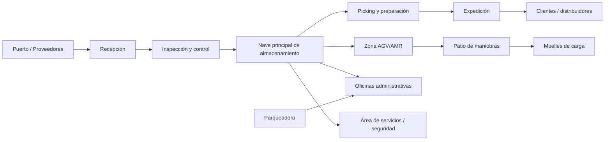

# Descripción del ED Park

## Objetivo de la sección

El objetivo de esta sección es describir de forma técnica, funcional y realista el objeto virtual del proyecto ED Park, con énfasis en su ubicación, dimensión, estructura física, flujo operativo, nivel de automatización y el tipo de servicios logísticos que debe prestar. Esta descripción constituye la base para el diseño posterior de la infraestructura de telecomunicaciones, el software de gestión, los equipos hardware y el plan de montaje.

La descripción debe ser coherente con el contexto académico del proyecto, con la realidad logística de un parque de productos electrónicos y con el alcance completo del sistema, que incluye no solo la red, sino también la operación del almacén, flujo de materiales, interacción humana y automatización.

---

## 1. Descripción narrativa del ED Park

El ED Park es un parque logístico para productos electrónicos ubicado en Matanzas, Cuba, en una zona estratégica cercana al puerto y a los principales corredores de distribución interna del país. Su función principal es recibir, almacenar, clasificar, gestionar y despachar productos electrónicos de consumo, componentes, equipos de telecomunicaciones y soluciones para uso industrial. El proyecto se plantea como un centro logístico de mediana automatización, capaz de operar de forma eficiente, segura y trazable, con un nivel de digitalización que permite reducir tiempos operativos y mejorar la visibilidad de inventario.

La instalación comprende dos naves principales para almacenamiento y flujo operativo, un área de recepción y expedición, un patio de maniobras, un aparcamiento, oficinas administrativas y una zona reservada para AGV/AMR. Su diseño integra infraestructura física, sistemas de gestión de almacén, equipos de transporte interno, sensores, tecnología de red y procesos de operación coordinados para soportar la actividad comercial del parque. El objetivo de la operación no es únicamente el almacenamiento de mercancía, sino la ejecución de procesos logísticos más complejos: recepción, control de calidad, picking, consolidación, despacho y devoluciones.

En términos de organización, el parque debe operar como un sistema logístico moderno, con capacidad de soportar variedad de SKU, frecuencia media de movimiento, control de inventario y coordinación de personal con equipos automatizados. La automatización propuesta no pretende sustituir por completo la operación manual, sino complementar el trabajo humano con tecnologías como AGV, lectores RFID, escáneres, WMS y red industrial, equilibrando productividad, seguridad y costo. La operación del ED Park se organiza como un conjunto integrado de procesos físicos, tecnológicos y de gestión, lo que la convierte en un objeto realista y viable para la propuesta del proyecto académico.

---

## 2. Ubicación y justificación estratégica

### 2.1 Ubicación

- Ciudad: Matanzas, Cuba
- Zona: cercana al puerto de Matanzas
- Entorno: corredor logístico y comercial cercano a proveedores, distribuidores y clientes industriales

### 2.2 Justificación estratégica

La ubicación del ED Park responde a varios factores clave:

1. Proximidad al puerto permite reducir tiempos de recepción y despacho de carga internacional y regional.
2. El acceso a la red de distribución nacional facilita la entrega a clientes comerciales, retailers y empresas de telecomunicaciones.
3. La zona está orientada a actividades logísticas y industriales, lo que favorece la integración con proveedores y clientes especializados.
4. La combinación de tráfico terrestre, almacenamiento y operación industrial hace viable la implementación de infraestructuras de telecomunicación, automatización y seguridad.
5. La ubicación permite desarrollar una solución que combine logística convencional con automatización media y tecnologías conectadas.

La estrategia del proyecto no es instalar un almacén aislado, sino crear un punto logístico de valor para la distribución de productos electrónicos en Cuba, con capacidad para atender demanda y volumen de despacho comercial de forma segura y ordenada.

---

## 3. Superficie y distribución

### 3.1 Superficie total

- Superficie total estimada: 0.5 hectáreas
- Equivalente: 5,000 m²

### 3.2 Distribución propuesta

| Área | Superficie estimada | Función principal |
|---|---:|---|
| Nave principal | 2,200 m² | Almacenamiento de productos electrónicos, preparación y picking |
| Nave de recepción/expedición | 1,200 m² | Recepción, inspección, consolidación y despacho |
| Patio de maniobras | 700 m² | Movimiento de camiones, contenedores y vehículos internos |
| Aparcamiento | 350 m² | Estacionamiento de personal y transporte de apoyo |
| Zona AGV/AMR | 300 m² | Movimiento de vehículos automatizados y rutas internas |
| Oficinas administrativas | 250 m² | Dirección, logística, calidad, compras y control |
| Área verde / servicios | 200 m² | Señalización, zonas ajardinadas y puntos de servicio |
| Muelles de carga | 4–6 posiciones | Recepción y expedición en carga y descarga |

### 3.3 Distribución operativa general

El parque se organiza en bloques funcionales que permiten separar flujo de entrada, almacenamiento y salida, reduciendo la mezcla de actividades y mejorando la seguridad operativa. La nave principal debe estar conectada con la zona de recepción, el patio y la zona de AGV, mientras que la zona administrativa queda físicamente separada para garantizar control y operación segura.

---

## 4. Tipo de mercancía y requisitos especiales

### 4.1 Tipo de productos

La mercancía principal del parque corresponde a productos electrónicos, entre ellos:

- equipos de consumo;
- componentes electrónicos;
- dispositivos de telecomunicaciones;
- equipos eléctricos e industriales;
- materiales para proveedores y distribuidores;
- artículos de mantenimiento y repuestos.

### 4.2 Requisitos especiales

Estos productos presentan requisitos específicos que impactan la infraestructura y la tecnología:

- control de temperatura y humedad en zonas críticas;
- protección contra polvo y descargas electrostáticas;
- trazabilidad de lotes y series;
- control de inventario por SKU y ubicación;
- manejo cuidadoso en recepción y despacho;
- necesidad de etiquetado digital y lector RFID/código de barras;
- separación por tipo de producto y nivel de sensibilidad;
- seguridad física y cibernética para el manejo de información de inventario.

La combinación de productos de alto valor y sensibilidad técnica exige un nivel de control superior al de un almacén tradicional, especialmente en términos de diagnóstico, localización, almacenamiento y seguridad.

---

## 5. Nivel de automatización

El ED Park se diseña como un almacén de automatización media, con un nivel de digitalización que combina operación humana con tecnologías de apoyo. Este enfoque es realista para el contexto académico y para una planta logística de este tamaño.

### 5.1 Componentes del nivel de automatización

- 5 a 8 AGV/AMR para transporte interno de cajas y palets.
- Identificación por RFID y lectura de códigos de barras.
- WMS para control de inventario, ubicaciones y flujo de trabajo.
- Cintas o transporte básico para transferencia de mercancía.
- Sensores IoT para temperatura, humedad, movimiento y entorno.
- Supervisión visual y registro de eventos por control central.

### 5.2 Características funcionales

El sistema considera:

- rutas internas definidas para AGV;
- control de acceso por zonas;
- monitoreo de inventario en tiempo real;
- trazabilidad de movimientos y recepciones;
- coordinación entre almacenamiento, picking y expedición;
- soporte a procesos de entrega, reubicación y devoluciones;
- reducción de errores operativos y tiempos de preparación.

### 5.3 Nivel de automatización esperado

El proyecto no exige un almacén totalmente autónomo ni una fábrica 4.0 completa, sino un sistema sobrio y viable, con automatización útil en los puntos críticos del flujo logístico. Esta elección refuerza la idoneidad del proyecto para una propuesta vendible y técnicamente justificable frente a un cliente industrial.

---

## 6. Estructura física del ED Park

### 6.1 Diagrama estructural (Mermaid)

### 6.2 Distribución física en bloques

- Entrada principal: recepción de mercancía.
- Nave principal: almacenamiento y preparación.
- Nave secundaria: recepción y expedición rápida.
- Patio: maniobras de camiones y transporte interno.
- Zona AGV: rutas automatizadas y circulación segura.
- Oficinas: supervisión, administración y soporte técnico.
- Muelles: carga y descarga de camiones.

La separación funcional es una decisión clave para reducir accidentes, mejorar flujo y permitir un diseño de red y seguridad más ordenado.

---

## 7. Flujos operativos diarios

### 7.1 Recepción

- Llegada de camiones o proveedores.
- Registro documental y control de entrada.
- Ubicación del vehículo en muelle correspondiente.
- Descarga de mercancía y verificación inicial.
- Identificación por código de barras o RFID.
- Inspección de cantidad, daño y estado de envío.
- Registro en WMS y asignación de ubicación de almacenamiento.

### 7.2 Almacenamiento

- Las cargas se clasifican por tipo, valor y requerimientos especiales.
- Se asignan ubicaciones según el sistema de gestión.
- Los sistemas de almacenamiento soportan rotación por FIFO o FEFO según aplicación.
- Los AGV o equipos de transporte interno trasladan la mercancía a su zona asignada.
- Se registra la ubicación exacta para trazabilidad.

### 7.3 Picking

- El sistema identifica los pedidos pendientes.
- Se seleccionan unidades según pedido, prioridad y ruta de entrega.
- El personal realiza la preparación en zona designada.
- Los equipos automatizados pueden apoyar la extracción y traslado de materiales.
- Se valida el contenido antes del embalaje.

### 7.4 Expedición

- Se consolida la mercancía por cliente o ruta.
- Se verifica la documentación del envío.
- La mercancía pasa a zona de carga y despacho.
- Se coordina la salida desde el muelle asignado.
- Se confirma entrega y cierre del pedido en WMS.

### 7.5 Devoluciones

- El cliente devuelve productos por defectos, errores de pedido o materiales no conformes.
- El sistema registra la devolución y crea un flujo específico.
- Se revisa condición, cantidad y trazabilidad del lote.
- Si procede, se reintegra al inventario o se envía a zona de revisión.
- Se informa al área comercial y logística para cierre del caso.

---

## 8. Personal necesario

La operación del ED Park requiere personal técnico y operativo para cubrir las distintas funciones del almacén y la infraestructura tecnológica.

| Rol | Cantidad estimada | Funciones principales |
|---|---:|---|
| Coordinador general del parque | 1 | Supervisión general, coordinación operativa y decisiones del flujo |
| Supervisor de almacén | 2 | Gestión del inventario, cumplimiento de KPIs, trazabilidad |
| Operadores de recepción | 3–4 | Recepción, inspección y registro de mercancía |
| Operadores de almacenamiento | 5–6 | Ubicación, manipulación y movimiento de inventario |
| Pickers / preparadores | 4–6 | Picking, preparación y consolidación de pedidos |
| Operadores de expedición | 3–4 | Carga, despacho, documentación y control de salida |
| Técnicos de sistemas y telecom | 2–3 | Red, Wi‑Fi, switches, gateways, infraestructura de comunicación |
| Técnicos de mantenimiento | 2–3 | Mantenimiento de AGV, equipos y instalaciones |
| Personal de seguridad | 2–3 | Control de accesos, vigilancia y monitoreo del perímetro |
| Administrativos y logística | 3–4 | Compras, facturación, atención al cliente, control documental |
| Especialistas de soporte IT / ciberseguridad | 1–2 | Seguridad, redes, integración y monitoreo de software |

El personal total estimado ronda las 30–38 personas, dependiendo de la variante y del volumen de operación. Este factor es relevante para diseñar la infraestructura, la cobertura de red y los procesos de gestión del parque.

---

## 9. Experiencia del cliente

La experiencia del cliente en el ED Park debe ser clara, segura y eficiente. El cliente no solo observa un almacén, sino una operación logística coordinada con tecnología y servicios bien definidos.

### 9.1 Cómo interactúa el cliente

- El cliente entrega o recibe mercancías en muelle asignado.
- Puede consultar el estado de su pedido, inventario o entrega mediante un canal de seguimiento.
- Tiene acceso a información de recepción, despacho y confirmación de entregas.
- Puede entrar en contacto con el área de logística para gestionar cambios, devoluciones o incidencias.
- El personal del cliente se comunica con el sistema mediante interfaces rápidas y confiables.

### 9.2 Experiencia de servicio esperada

El cliente valora principalmente:

- rapidez en la recepción y despacho;
- seguridad en la manipulación de mercancías;
- trazabilidad de lotes y entregas;
- información clara sobre tiempos de operación;
- respuesta ante incidencias;
- continuidad de servicio sin interrupciones.

La experiencia del cliente se optimiza si la operación del almacén está digitalizada, visible y coordinada con un sistema de gestión que permita reducir errores y menos tiempo de espera.

---

## 10. Checklist de la sección

- [x] Definir objetivo de la sección
- [x] Describir narrativa del ED Park
- [x] Definir ubicación y justificación estratégica
- [x] Establecer superficie total y proporciones
- [x] Describir distribución del parque por áreas
- [x] Identificar tipo de mercancía y requisitos especiales
- [x] Definir nivel de automatización esperado
- [x] Incluir diagrama físico de la estructura
- [x] Describir flujos operativos diarios
- [x] Definir personal necesario por rol
- [x] Explicar experiencia del cliente con el sistema
- [x] Revisar coherencia con el alcance total del proyecto

---

## 11. Conclusión

La descripción del ED Park debe entenderse como el punto de partida del diseño completo del proyecto. El parque logístico no es solo un espacio físico de almacenamiento; es un sistema integrado de bienes, personal, infraestructura, telecomunicaciones, automatización, control y servicio. La coherencia entre su estructura física, el tipo de mercancía, el nivel de automatización y la experiencia del cliente será la base para definir la arquitectura tecnológica y la gestión del proyecto en fases posteriores.
